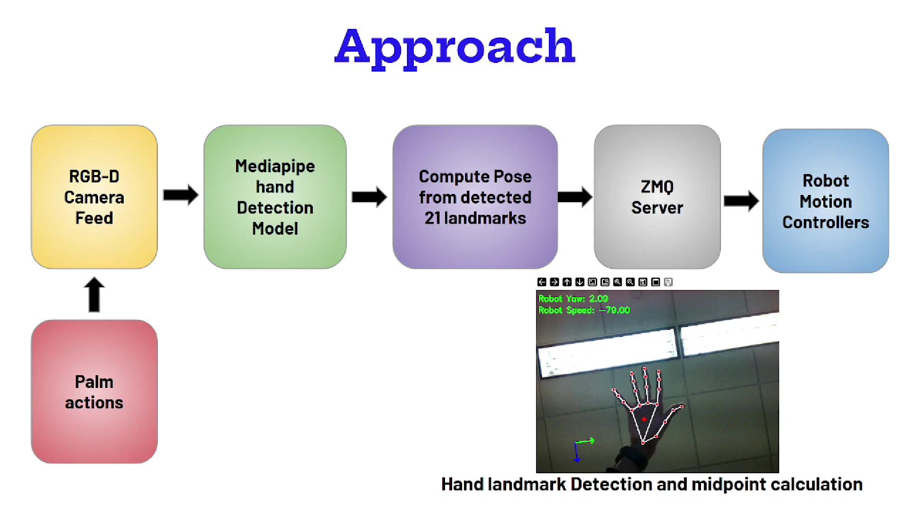

# RAVEN TELEOP
Gesture Based Tele-Operation Unleashed! \
RAVEN TELEOP is versatile, low-cost, robot-agnostic, simulator-agnostic and requires no special hardware.

(CSCI5551 Course Project)

## Demo
Full Demo Link: [Demo](https://www.youtube.com/watch?v=-pNUi8llU3A&t=25s)


## Introduction
RAVEN TELEOP is a middleware tele-operation framework for robots that translates 6-DoF hand gestures into real-time tele-operation commands, enabling seamless control across simulators like KinEval, PyBullet, Genesis, and Gazebo-ROS.
- **Workflow**:


## Supported Platforms

| Category              | Supported Items                            |
|-----------------------|---------------------------------------------|
| **Simulators**        | ✅ Gazebo · ✅ PyBullet · ✅ Kineval         |
| **Simulation Robots** | ✅ Turtlebot · ✅ Tugbot · ✅ Unitree A1 · ✅ MR2 |
| **Real-World Robots** | ✅ Turtlebot                                |

`Note`: Moreover, you can follow codebase in `/simulators` to similary extend it to additional platforms.


## Installation

1. Create the mamba environment (fast drop-in replacement for conda)
   ```bash
   mamba env create -f env.yaml
   mamba activate raven_env
    ```

## Run

1. **Server side**: Run hand Landmark detection, create server & send data over ZMQ
    ```
    python landmark_detection.py
    ```

2. **Client side**: follow instructions in `simulators/README.md` to run our example simulated/real-world platforms.

## License
MIT

