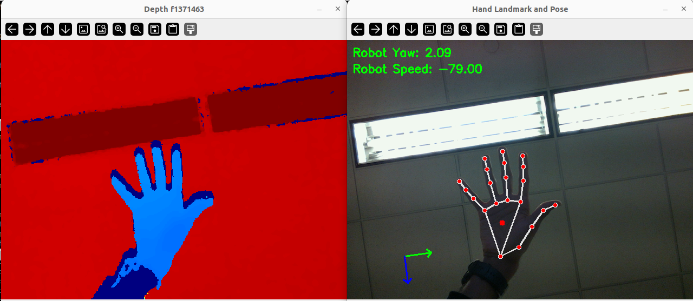

# raven-teleop
CSCI5551

# Simulators
 - Gazebo ✅
 - Genesis
 - Mujoco
 - Kineval

# Simulation Robots
 - Turtlebot ✅
 - Tugbot ✅
 - Legged robot(eg: SPOT)
 - Drone

# Realworld Robots
- Turtlebot

# Scripts
## Installation:
- Create mamba/conda environment
```
mamba env create -f env.yaml
```
- Activate the environment using:
```
mamba activate raven_env
```


## Run:
- To test Intel Realsense RGB-D L515 camera:
```
python camera_realsense.py
```

- Run hand Landmark detection:
```
python landmark_detection.py
```


### Robot Speed+Angles Calculation

