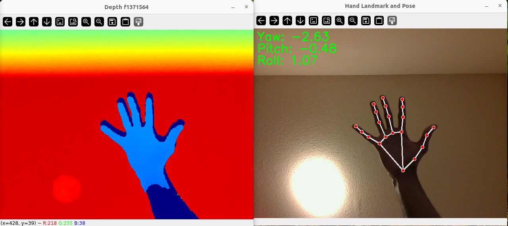

# raven-teleop
CSCI5551

# Simulations
 - Gazebo
 - Genesis
 - Mujoco
 - Kineval

# Scripts
- To test Intel Realsense RGB-D L515 camera:
```
 $ python camera_realsense.py
```

- Run hand Landmark detection:
```
 $ python landmark_detection.py
```



#TODO: Fix YPR-calculation